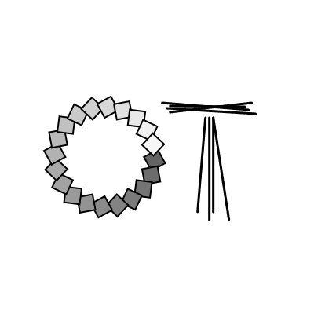

# Week 1 Task - Initial Sketch

**Sketch your initials (or name) using only primitive shapes, points, and/or lines.** Play with shape, colour, stroke, transparency (alpha). 

Think about simplifying letter forms; think about adding complexity or flourishes.

#### OPTIONAL:
Want to go further? Create your own shapes by using [`beginShape()`](https://p5js.org/reference/p5/beginShape/) and vertices.

## When you're ready to submit your sketch...

1. Complete the task sketch using the P5.js web editor: <https://editor.p5js.org/>
2. _Make sure you regularly save your work._
3. When you're ready to submit your work, copy your code into this repository's [sketch.js](sketch.js) file.
    - Open [sketch.js](sketch.js) and **Edit** the file (pencil icon, or `e`), 
    - Copy in your code from the p5.js web editor.
    - Click **`Commit changes...`** when ready to submit.

> [!NOTE]
> You don't need to worry about all the other files here, but you can _optionally_ edit this README.md file if you want to add any introduction, notes or explanations.

Any questions/problems, email <o.thurley@leeds.ac.uk>

## 🌐 Optional: View Your Project Online

You can easily view your project as a standalone webpage!

1. Go to your repository **Settings** (top menu) or `https://[your-username].github.io/[repository-name]/settings/pages`
2. On the left, select **Pages**.
3. Under the settings for **Build and deployment**, set the **Branch** from None to `master` `/root` and click **Save**.

4. **Your project will automatically deploy:**
   - GitHub Pages will automatically deploy your project when you push code
   - Wait 2-3 minutes for deployment to complete

5. **Access your live project:**
   - Your project will be available at: `https://computational-art-leeds.github.io/[repository-name]`
   - Share this URL with friends or include it in your portfolio!

> [!IMPORTANT]
> Your repository must be set to **Public** for GitHub Pages to work with the free GitHub plan. This is the default setting, but you can always change this later if you want: Go to `Settings` > `Danger Zone` > `Change repository visibility`...
